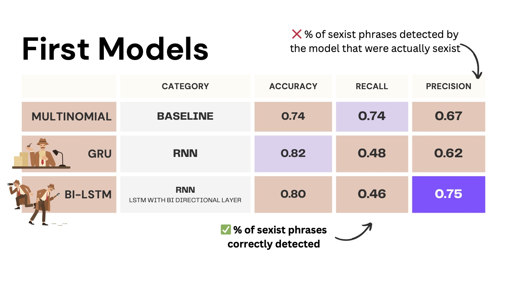
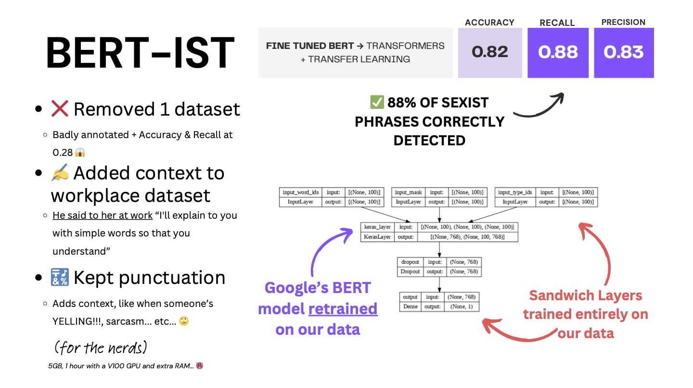

# detecting-sexism

In the context of the final project for Le Wagon Data Science & AI course, we have built an NLP model able to detect sexism in text. 
The initial classification will be a binary 'sexist' or 'not sexist'. 

As opposed to previous research and models, we used a dataset composed of 6 text corpi, not limited to social media. 
* [“Call me sexist, but...”](https://github.com/gesiscss/theory-driven-sexism-detection), 2021
* [Explainable Detection of Online Sexism](https://github.com/rewire-online/edos/tree/main) 2023
* [sEXism Identification in Social neTworks](http://nlp.uned.es/exist2021/) 2021
* [Expert Annotated Dataset for the Detection of Online Misogyny](https://aclanthology.org/2021.eacl-main.114.pdf) 2021
* [Sexist Stereotype Classification](https://github.com/djinn-anthrope/Sexist_Stereotype_Classification/tree/master) 2020
* [Detection of Sexist Statements ... at the Workplace](https://github.com/dylangrosz/Automatic_Detection_of_Sexist_Statements_Commonly_Used_at_the_Workplace/tree/master) 2020

As the datasets use different annotation rules, we hoped to provide a richness and nuance to the model, at the risk of being 'overly accusatory'. 

Our final model, which can be tested [here](https://youre-not-sexist.streamlit.app/), is a fine-tuned BERT model, trained for Precision.

The options for further exploration include, but are not limited to:
* Developing a french model
* Developing a multi-lingual model
* Augmenting our dataset(s)
  * Translation
  * Scraping reddit/instagram/youtube/twitch
  * Generative AI
  * Text templates (eg, "I hate women, they're all (bitch/slut/whore)s")
* Annotating our own data set based on gender theory and language theory
* Multi-class classification 
